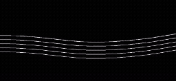
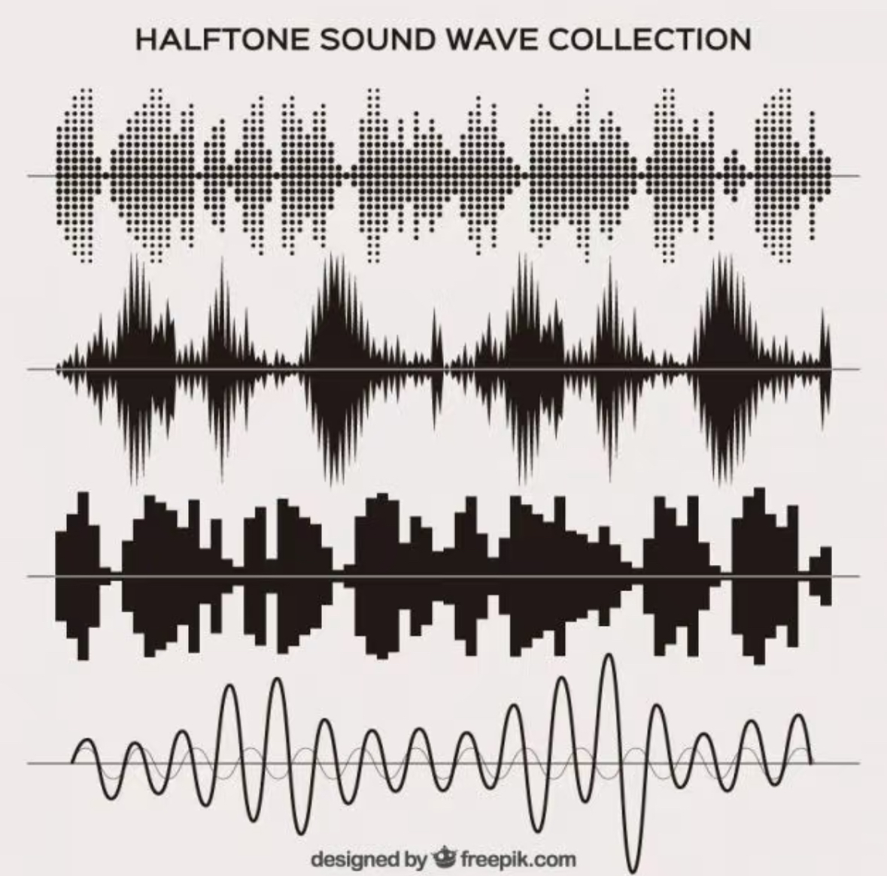

# Audio-Responsive Animation Based on Nasreen Mohamedi's Artwork
Aria Xie
yxie0369
550008800

## Interaction Instructions
- Click the **Play** button on the top left to start the music.  
- Move the mouse horizontally on the canvas. The further to the **right** the mouse is, the **faster** the music plays.
- Different line groups and trapezoidal graphics will undergo different animated changes according to the audio frequency

## Code Driver: Audio
- This project transforms **audio frequencies** into **visual changes** using `p5.FFT`. Line **spacing**, **weight**, and **opacity** are animated based on bass, mid, and treble energy. 
    - Driven by real-time audio analysis using `p5.FFT`  
    - Bass → line **thickness**  
    - Mid → **opacity/transparency**  
    - Treble → line **spacing** and **trapezoid distortion**  

- Uniqueness  
*Unlike other group members using color, rotation, or visibility toggles, this animation uses **audio frequency-based geometry deformation and transparency control** to mimic Nasreen Mohamedi’s minimal and abstract style.*

## Inspiration

[Inspiration Link](https://youtu.be/dCI32Vi-WP0?si=tmoozK0Dc4WatJ1Z)

Even simple lines can change according to the audio to achieve the visualization of the audio. The artworks we choose are composed of different lines, so I can classify the line groups and make different line groups change differently according to different frequencies of the audio.

Sound Wave can take on various forms of expression, and I can also make this piece of art a special kind of Sound Wave.

## Technical Overview
- `p5.FFT` extracts **bass**, **mid**, and **treble** frequency levels.
- `map()` maps frequency values to visual properties.
- Real-time frame updates via `draw()`. 

**Compared with the group code**
- Compared to the group code, I added a music player to load and play an audio file. I used FFT to analyze the sound in real time. In the original code, many values like line length or spacing were fixed, but in my version, they react to the music. This gives the shapes a stronger sense of rhythm and makes the whole piece feel alive.

## External Technique
I referred to the [Example: Audio Player in the p5.js Library](https://p5js.org/examples/imported-media-create-audio/). 
This code creates an audio player and lets the viewer control the playback speed of the music by moving the mouse left or right on the screen. When used in conjunction with FFT, it enables users to freely select different parts of the music to view the animation. When users use the mouse to make the music faster, the animation will change more quickly accordingly.